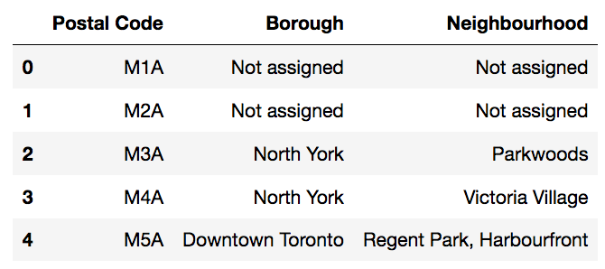
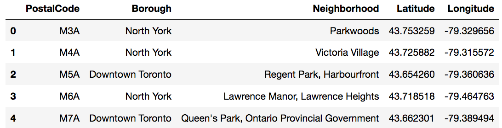
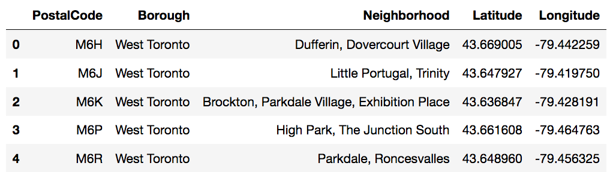
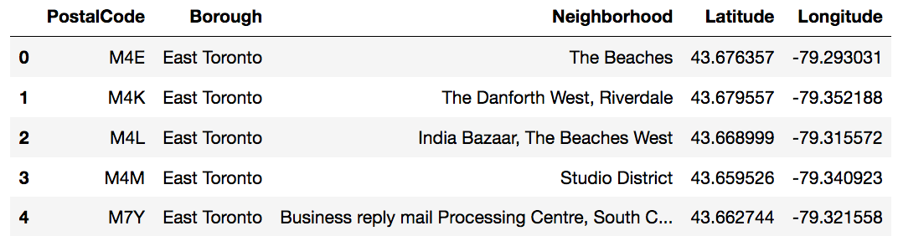
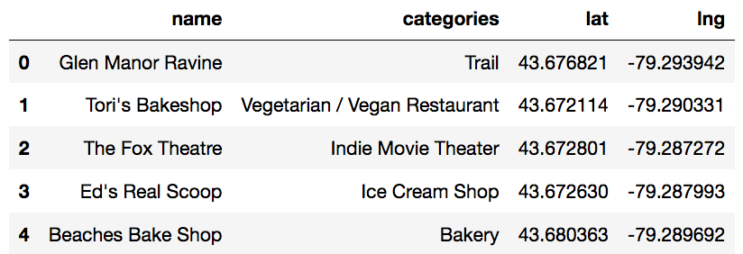
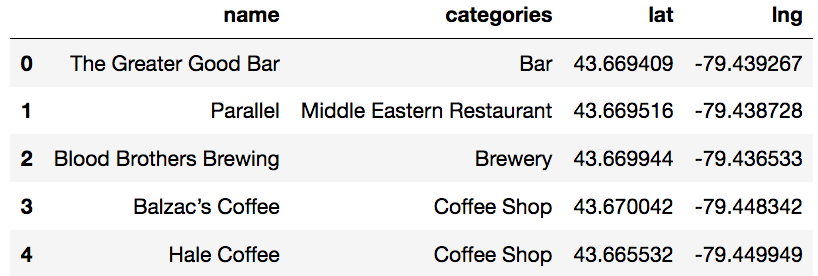
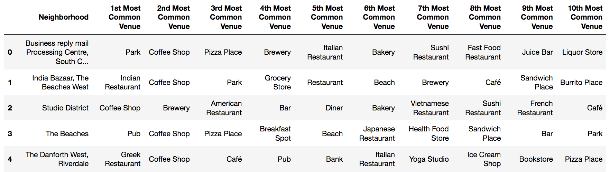
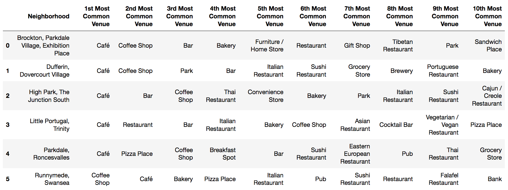

# Analyzing-Toronto-Neighborhoods
## by Sushant Deshpande

The basis of this study is to help a small group of investors planning to open their first brewery/restaurant in Toronto. Being that Toronto is the most populated city in Canada, and continually ranks as an important global city based on a high quality of living, the choice to expand into the neighbor of the north market was an easy selection for the investing group. However, with limited knowledge of the Toronto market, the group of investors have selected us to assist in the selection of which areas of Toronto will facilitate a launch of their brewery/restaurant expansion. In order to achieve this, We’ll perform the following:

 - Get the postal codes from Wikipedia using web scraping method in python.
 - Clean up the data and merge it with the geopositional data provided to us by Coursera.
 - Use FourSquare to get the venues in our desired neighbourhood.
 - Use python to find to 10 most popular venues and display it graphically.

### STEP 1 - Importing the data

We begin with grabbing the postal codes from Wikipedia’s webpage using python’s web scraping method.
Code for scraping looks like this:

    url = "https://en.wikipedia.org/wiki/List_of_postal_codes_of_Canada:_M"
    tables = pd.read_html(url)
    table_df = tables[0]
   

### STEP 2 - Cleaning the data

More than one neighbourhood can exist in one postal code area. For example, in the table on the Wikipedia page, you will notice
that M5A is listed twice and has two neighbourhoods: Harbourfront and Regent Park. These two rows will be combined into one
row with the neighbourhoods separated with a comma.

Now we need to combine our data with geospatial_coordinates.csv file provided to us. This’ll get us coordinates for each of the
postal codes. These coordinates will be used in the next step with FourSquare

### STEP 3 - FourSquare

First, we split the data in to 2 categories, East Toronto and West Toronto.

With FourSquare, we get the list of venues that are close to a selected postal code.

When we run the analysis for the whole of East and West Toronto, we can see that Four Square tells us that East Toronto has 133 unique categories and West Toronto has 162 unique categories.

We analyze each neighbourhood using one hot encoding. Next, we group rows by neighbourhood and by taking the mean of the frequency of occurrence of each category and print each neighbourhood along with the top 5 most common venues.

